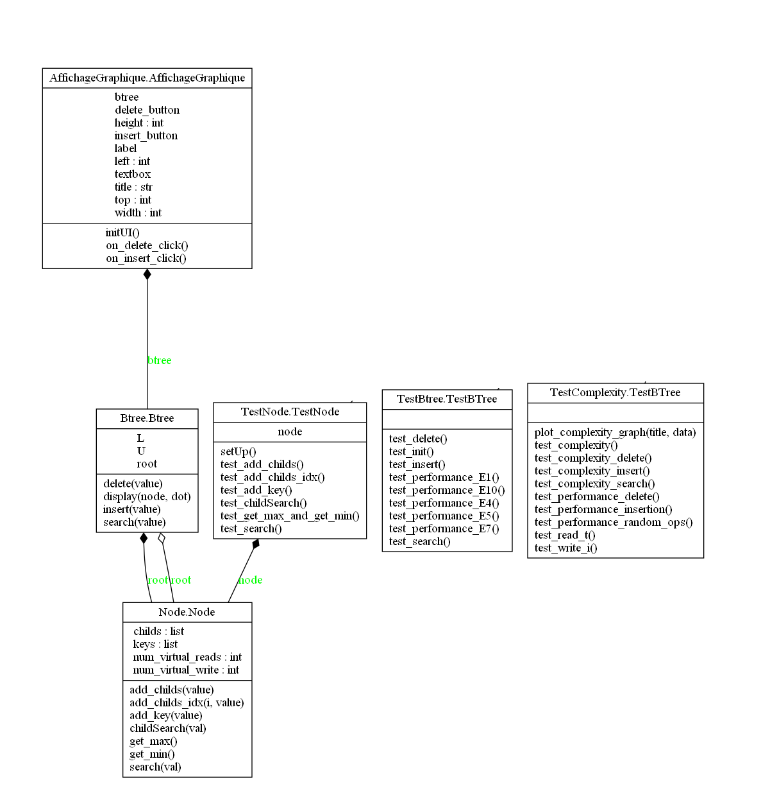
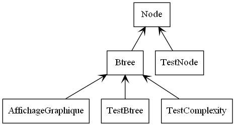
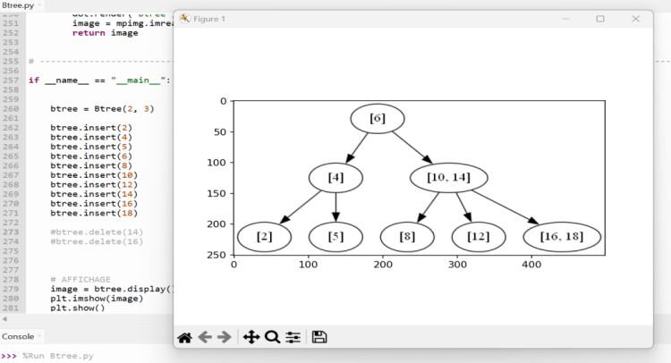
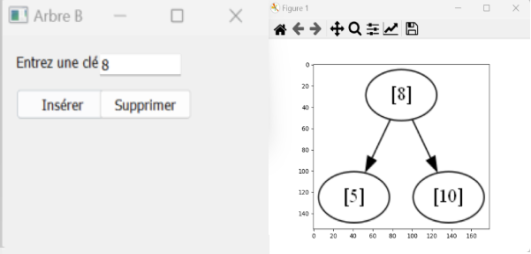
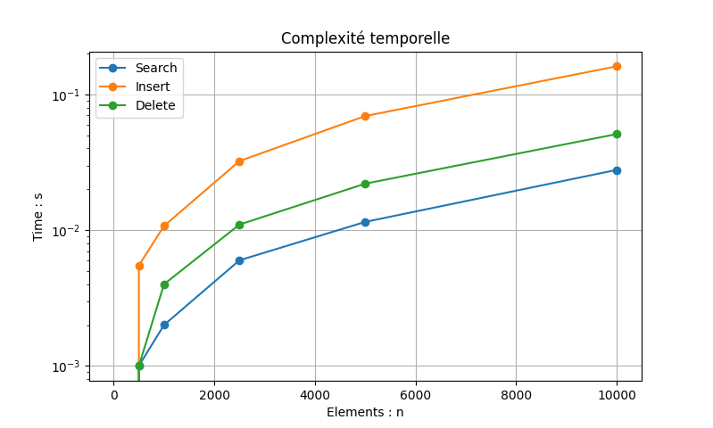

# 🚧 Projet L3


## 🌳 Arbre B 🌳


### Noms et prenoms: 

 - Ismail Aymane : aymane.ismail.etu@univ-lille.fr | @aymane.ismail.etu
 - Hachour Mohammed ouramdane : mohammed.hachour.etu@univ-lille.fr | @mohammed.hachour.etu

Groupe 1 - Licence 3 Informatique - 2022/2023


### Sommaire 📝

- [1 : Introduction](#intro)
- [2 : Prérequis ](#pr)
- [3 : Exécution](#exec)
- [4 : Diagrammes UML](#uml)
- [5 : Pseudo-code des algorithmes](#code)
- [6 : Visualisation](#viz)
- [7 : Tests et complexité](#viz)
- [8 : Bibliographie](#ref)


### [1] Introduction sur le sujet du projet
---

- Un arbre B « B-tree » est une structure de données en arbre équilibré. Les arbres B sont principalement mis en œuvre dans les mécanismes de gestion de bases de données et de systèmes de fichiers. Ils stockent les données sous une forme triée et permettent une exécution des opérations d'insertion et de suppression en temps toujours logarithmique.

- Un arbre b est une forme spéciale d'arbre qui respecte certaines propriétés particulières, comme le fait d'avoir un nombre maximum et minimum de noeuds et d'avoir un ordre de clé précis. Ces propriétés permettent à un arbre b d'être très efficace pour rechercher, ajouter et supprimer des données.

- Soient L et U deux entiers naturels non nuls tels que L ≤ U. En toute généralité, on définit alors un L-U arbre B de la manière suivante : chaque nœud, sauf la racine, possède un minimum de L−1 clés (appelées aussi éléments), un maximum de U−1 clés et au plus U fils. Pour chaque nœud interne — nœud qui n’est pas une feuille —, le nombre de fils est toujours égal au nombre de clés augmenté d’une unité. Si n est le nombre de fils, alors on parle de n-nœud. Un L-U arbre ne contient que des n-nœuds avec L ≤ n ≤ U. 

- Inventé par Rudolf Bayer et Edward Meyers McCreight, 1970, Mathematical and Information Sciences Laboratory BOEING SCIENTIFIC RESEARCH LABORATORIES July 1970.

(https://fr.wikipedia.org/wiki/Arbre_B & https://infolab.usc.edu/csci585/Spring2010/den_ar/indexing.pdf)


### [2] Prérequis (Python3)
---

**Module requis :**

- `matplotlib`
- `PyQt5`
- `graphviz`

**Commande :**

```bash
pip install matplotlib
pip install PyQt5
pip install graphviz
```

`ou`

```bash
    make install
```


### [3] Exécution
---

`Interface et visualisation graphique :`

```bash
    make
```

`Visualisation graphique :`

```bash
    make btree
```

`Execution des test :`

```bash
    make test
```


### [4] Diagrammes UML

---
`[FIGURE 1] : Diagramme de classes UML`



`[FIGURE 2] : Diagramme de paquetages UML`




### [5] Pseudo-code des algorithmes

---

#### Classe Node :


- `Recherche`

        fonction search(val):
        
                si longueur(self.keys) == 0 alors
                        retourner Faux
                sinon si val est dans self.keys alors :
                        retourner Vrai
                sinon
                        i = childSearch(val)
                        si i < longueur(self.childs) alors :
                                res = self.childs[i].search(val)
                                si res est Vrai alors
                                        retourner res
                        retourner Faux


#### Classe Btree :

- `Recherche`

        fonction search(self, value):
        
                found = search(value) à partir de la racine pour trouvé la clé
                si found:
                        retourner True
                sinon:
                	pour chaque child dans node.childs:
        				res = child.search(value)
        				si res:
        					retourner res
                retourner self.root.search(value)
    
- `Insertion`

        fonction insert(self, value) :
        
                si self.search(value) est Faux alors :
        
                        self._insert(self.root, value)
        
                        si len(self.root.keys) > self.U -1 alors
                                new_root = Node()
                                new_root.add_childs(self.root)
                                self._split_child(new_root, self.root)
                                self.root = new_root
    
    
        fonction _insert(node, value):
        
                i = node.childSearch(value)
                si la longueur de node.childs est égale à 0:
                        node.add_key(value)
                sinon:
                        child = node.childs[i]
                        _insert(child, value)
                        si la longueur de child.keys est supérieure à U - 1:
                        _split_child(node, child)
        
        fonction _split_child(parent, child):
        
                new_child = new node()
                mid = longueur(child.keys) division euclidienne par 2
                milieu = clé du milieu
                new_child.keys = copie des clés a partir l'indice 'mid'
                child.keys = copie des clés jusqu'a l'indice 'mid'
        
                si longueur(child.childs) > 0:
                        new_child.childs = child.childs[mid+1:] (copie des enfants a partir l'indice 'mid+1')
                        child.childs = child.childs[:mid+1] (copie des enfants jusqu'a l'indice 'mid+1')
        
                i = parent.add_key(milieu) ajout clé du milieu et recupere son indice​    
                ajout du nouvel enfant à l'indice i dans le parent


- `Suppression`

        fonction delete(value):
        
                Si search(value) est vrai alors :
                        appeler _delete(noeud_racine, value)
        
                        Si la longueur des clés du noeud racine est égale à 0 et la longueur des enfants du noeud racine est supérieure à 0 alors :
                                mettre à jour le noeud racine avec son premier enfant


        fonction _delete(node, value):
    
                si value dans node.keys:
                        indice = indice de value dans node.keys
                        si node.childs est vide: 
                                supprimer node.keys[indice]
                        sinon:
                                si longueur(node.childs[indice].keys) >= L:  # Juste avant
                                        node.keys[indice] = node.childs[indice].obtenir_max()
                                        supprimer(node.childs[indice], node.keys[indice])
                                sinon si longueur(node.childs[indice + 1].keys) >= L:  # Juste après
                                        node.keys[indice] = node.childs[indice + 1].obtenir_min()
                                        supprimer(node.childs[indice + 1], node.keys[indice])
                                sinon:  # Fusionner
                                        fusionner node.childs[indice] avec node.childs[indice + 1] et node.keys[indice]
                                        supprimer(node.childs[indice], valeur)
                sinon:
                        indice = node.rechercheEnfant(valeur)
                        si longueur(node.childs[indice].keys) <= L - 1:  
                                si indice > 0 et longueur(node.childs[indice - 1].keys) >= L:
                                        décaler clé de node.childs[indice - 1] vers node.childs[indice]
                                sinon si indice < longueur(node.childs) - 1 et longueur(node.childs[indice + 1].clés) >= L:
                                        décaler clé de node.childs[indice + 1] vers node.childs[indice]
                                sinon:  # Fusionner
                                        si indice > 0:
                                        indice -= 1
                                        fusionner node.childs[indice] avec node.childs[indice + 1] et node.clés[indice]
    
                        _delete(node.childs[indice], valeur)


### [6] Visualisation

---

**Méthode 1 : Insertion/Suppression dans le main de la classe Btree avec affichage graphique matplotlib et graphviz (figure 3)**.


`[FIGURE 3] : Affichage graphique de Btree`




**Méthode 2 : Insertion/Suppression à partir d'une interface PyQt5 contenant 2 boutons : 'Insérer' et 'Supprimer', et avec un affichage matplotlib et graphviz dans la Classe AffichageGraphique (figure 4).**

`[FIGURE 4] : Interface et affichage graphique de Btree`




### [7] Tests et complexité

---


Nous avons rédigé des tests exhaustifs qui couvrent l'ensemble des cas possibles pour assurer la fiabilité de notre code. De plus, nous avons également conçu des tests spécifiques portant sur la complexité algorithmique, afin d'évaluer les performances de nos algorithmes dans différentes situations. Vous trouverez ci-dessous (figure 5) un graphique représentant la complexité temporelle de : Search, Insert et Delete. 

`[FIGURE 5] : Complexité temporelle`



### [8] Bibliographie 
---

Tous les graphiques et captures d'écrans proviennent de notre projet.

- Cours L3 S5 IHM PyQt5 : https://www.fil.univ-lille.fr/portail/index.php?dipl=L&sem=S5&ue=IHM&label=Semainier
- Matplotlib : https://matplotlib.org/stable/tutorials/introductory/pyplot.html
- GraphViz : https://graphviz.org/documentation/
- Python COO : https://python.doctor/page-apprendre-programmation-orientee-objet-poo-classes-python-cours-debutants
- Arbre binaire : https://pixees.fr/informatiquelycee/n_site/nsi_term_projet_4.html
- Vidéo arbre-b : https://www.youtube.com/watch?v=4T7QHDbIzxA
- Btree Visualization : https://www.cs.usfca.edu/~galles/visualization/BTree.html
- Pyreverse UML : https://deusyss.developpez.com/tutoriels/Python/Pyreverse/
